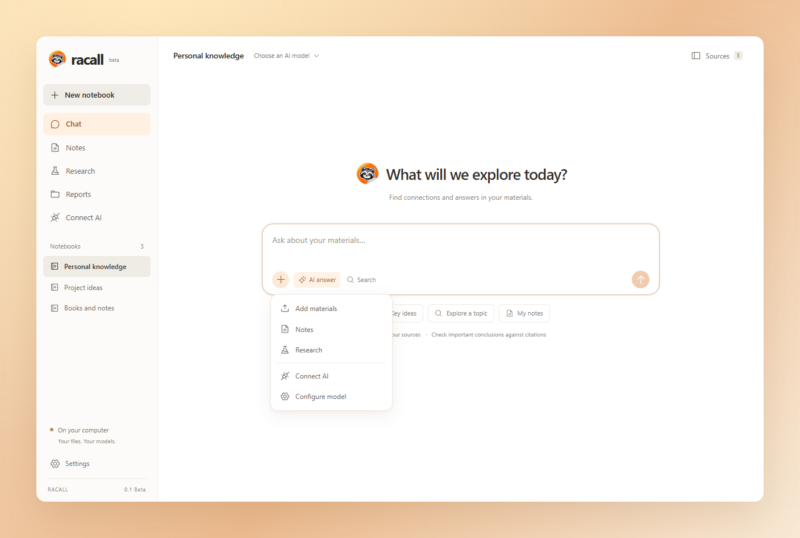

<p align="center">
  
  <picture>
    <source media="(prefers-color-scheme: dark)" srcset="assets/brand/wordmark-dark.svg" />
    
  </picture>
</p>

---

<h3 align="center">Racall is an open-source alternative to NotebookLM + Obsidian.</h3>
<p align="center">
  <a href="#features">Features</a> •
  <a href="#-get-started">Quickstart</a> •
  <a href="docs/GETTING_STARTED.md#first-notebook">Notebooks</a> •
  <a href="docs/README.md">Documentation</a>
</p>
<p align="center"></p>

## ⚡ Get started

Development of **0.2 Beta** has started. [Development notes](docs/releases/0.2.0-beta.1.md) · [Code map](docs/CODE_MAP.md). The downloads below are still **0.1 Beta**.

Download **Racall 0.1 Beta** for your operating system:

| Platform | Link |
| :--- | :--- |
| **Windows x64** | [Download](https://github.com/SleepyCodeMeow/Racall/releases/download/v0.1.0-beta.1/Racall-0.1.0-beta.1-win-x64.exe) |
| **macOS Apple Silicon** | [Download](https://github.com/SleepyCodeMeow/Racall/releases/download/v0.1.0-beta.1/Racall-0.1.0-beta.1-mac-arm64.dmg) |
| **macOS Intel** | [Download](https://github.com/SleepyCodeMeow/Racall/releases/download/v0.1.0-beta.1/Racall-0.1.0-beta.1-mac-x64.dmg) |
| **Linux x64 / Ubuntu (DEB)** | [Download](https://github.com/SleepyCodeMeow/Racall/releases/download/v0.1.0-beta.1/Racall-0.1.0-beta.1-linux-amd64.deb) |
| **Linux x64 (AppImage)** | [Download](https://github.com/SleepyCodeMeow/Racall/releases/download/v0.1.0-beta.1/Racall-0.1.0-beta.1-linux-x86_64.AppImage) |

More packages and checksums: [GitHub Releases](https://github.com/SleepyCodeMeow/Racall/releases). No Python, Node.js or Docker installation is required. [Russian documentation](README.ru.md).

All four native build and packaged smoke-test jobs passed for this release. See the [release notes](docs/releases/0.1.0-beta.1.md) for verification scope. Beta packages are unsigned; macOS packages are not notarized. Mobile apps are planned for a later release.

1. Open Racall and create a notebook.
2. Open **Sources** and import a document.
3. Use **Search** immediately, or connect your model in **Settings** to ask questions.
4. Open a citation to inspect the passage, then capture your ideas in **Notes**.

English is the default interface language. Switch to Russian in **Settings → Interface language**. The Windows installer also offers a language choice and applies it on first launch. Later updates keep your saved preference.

## Features

| Bring your sources | Build your knowledge |
| :--- | :--- |
| Import text PDFs, Markdown, TXT and DOCX | Write portable Markdown with frontmatter and wikilinks |
| Save public HTML pages by URL | Ask questions with source citations |
| Search locally, with optional embeddings | Inspect exact passages and PDF page references |
| Keep originals on your computer | Run research across your notebook and save reports |

- **Your choice of AI.** Connect an OpenAI-compatible API or an existing Ollama installation. Models need structured JSON output support; model quality varies.
- **Local files you own.** Notes and originals remain on disk. Open a notebook folder as an Obsidian vault, or use another Markdown editor.
- **Evidence you can inspect.** Answers undergo citation validation and a separate model critique. AI review can still miss mistakes: follow the citations.
- **Connect your tools.** A read-only MCP server exposes one selected notebook to compatible desktop clients.
- **Useful without a model.** Import, browse, write notes and run text search without API access.

The screenshot shows the real interface with sample content. Its orange backdrop is presentation artwork; window controls follow your operating system.

## Your model, your data

In **Settings**, enter the API base URL, key and model, or select **Ollama** and enter a model you already installed. Racall does not download model weights. Embeddings are optional.

API keys use the operating system keychain. With a cloud provider, questions and retrieved passages are sent to that provider; cloud embeddings send the extracted document text. Local storage does not mean cloud inference stays on your machine.

Back up your knowledge folder with Racall closed. The exact location is shown in Settings; the legacy folder name `OpenNotebook` is kept for compatibility. [Data and backup guide →](docs/GETTING_STARTED.md#data-and-backups)

## What to expect from the beta

0.1 focuses on the desktop knowledge workflow. Chat history is not persisted; save important output as notes or reports. Research runs synchronously and is interrupted when the app closes. Scanned PDFs need OCR elsewhere. Notebook rename/delete, source refresh, sync, mobile apps, graph view and remote MCP/OAuth are not included yet.

Automated AI tests use deterministic mock providers. Real model evaluation is still pending. Build checks do not replace manual installation and OS integration testing. [Release notes →](docs/releases/0.1.0-beta.1.md)

## Built with

| Language | Responsibility |
| :--- | :--- |
| **Python** | Knowledge service, document ingestion, retrieval, citations, research, MCP and backend tests |
| **TypeScript** | React interface, typed API client and localization |
| **JavaScript** | Electron desktop integration and UI smoke tests |
| **CSS** | Interface layout and styling |
| **PowerShell / Shell** | Developer setup on Windows and macOS/Linux |
| **NSIS** | Windows installation and language handoff |

The GitHub Languages bar reflects source bytes, so its proportions change as the project grows. Generated bundles, dependencies and installers are not source files and are excluded from the repository.

## Development

Install Node.js 24, Python 3.12 and uv, then:

```sh
npm ci
uv sync --frozen
npm run dev
```

Developer setup helpers: `./scripts/setup.sh` on macOS/Linux, or `./scripts/setup.ps1` in PowerShell. They install this checkout's locked dependencies; they do not install system tools.

```sh
npm test -- -q
npm run lint
npm run test:i18n
npm run check:release
npm run build
npm run typecheck
npm run test:desktop
npm run dist
```

Python binaries are built on each target OS and architecture. [Contributing](CONTRIBUTING.md) · [Release process](docs/RELEASING.md) · [Architecture decisions](docs/adr)

## Follow the project

Everything lives on GitHub for now: [downloads](https://github.com/SleepyCodeMeow/Racall/releases), [documentation](docs/README.md), [bugs and ideas](https://github.com/SleepyCodeMeow/Racall/issues), and [the roadmap](docs/ROADMAP.md). Read [CHANGELOG.md](CHANGELOG.md) for each release.

## License

Python core and tools: [Apache 2.0](LICENSE). Interface and desktop application: [AGPLv3](COPYING). Both allow commercial use and sale subject to their terms. [Component boundaries and contributor rights](LICENSING.md).

The already-published **0.1 Beta** downloads remain under their original MIT terms. This update changes the current branch's licensing documents without changing the application version or replacing existing release files.

Racall is independently developed and is not affiliated with NotebookLM, Obsidian or Unsloth.
